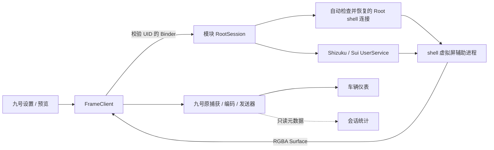

# 架构与统计

## 进程边界

Hook 和 UI 在九号进程；授权 API 仅在模块进程使用。模块持有会话与服务连接，shell 辅助进程创建并持有 VirtualDisplay。ADB Shizuku 直接启动 shell 子进程；UID 0 的 Shizuku / Sui 与 Root 模式在 app_process 启动前使用 `su 2000`，保持包名 `com.android.shell` 与实际 Binder UID 一致。

UserService 仅接受拥有者模块 UID，启动类和 APK 路径来自自己的安装信息；调用者不能传入命令或任意 APK。一次服务仅启动一个会话，使用独立 tag，避免旧连接清理移除后来会话。停止、Binder 死亡和超时均有回收路径。UserService 使用 API 13+ 的 Context 构造器。

核心计算类放在 `core/`，不依赖 Android UI；`client/` 管理独立的帧、控制及设置工作线程；`ui/` 只组织界面。跨包的公开方法是工程内部调用边界，不是稳定的外部 SDK。

## 服务绑定与授权

客户端使用 `FrameBridgeService.class.getName()` 生成绑定目标，避免包结构调整后仍拼接过期路径。主机测试核对该目标与 Manifest 的导出服务一致。

遵循 [官方 API 接入指南](https://github.com/RikkaApps/Shizuku-API#guide)，Manifest 中的 `ShizukuProvider` 在模块进程初始化 Sui；不在九号进程请求 Sui Binder，也不重复调用 `Sui.init`。模块服务创建时注册进程级 Binder received/dead 和 permission result 监听，不持有 Activity。收到 ready 回调后才启用授权请求，检查已授权状态与 `shouldShowRequestPermissionRationale`，仅由显式按钮操作调用 `requestPermission`。

请求期间用原子状态阻止重复申请；结果、错误或 Binder 断开会更新状态。授权窗口以 1.5 秒间隔读取状态，保留未保存的授权模式选择；关闭窗口时移除刷新回调。自动读取期间收到授权 / 保存点击时排队一次，不重复提交。状态读取不触发系统授权弹窗。

## 统计采样位置

- RGBA：`FrameClient.readImage` 成功复制帧后计数。预览重绘不计入。
- 供帧：原捕获入口成功接收模块画面时计数。可能涉及多个捕获调用，UI 因此标为次数。
- 编码：限定在 `cn.ninebot.capture.encoder.EncodeListener` 实现的带字节载荷回调，若提供 `MediaCodec.BufferInfo` 则按 offset / size 读取大小并忽略 codec-config。没有提供 BufferInfo 时只计参数实际可见范围，不猜测整数参数含义。
- RTP：限定九号的 `BluetoothRtpSender` / `NBBluetoothRtpSender` 发送方法，读取 RTP v2 头和载荷参数范围；排除 RTCP、截断头和错误 padding。没有消费 ByteBuffer 或修改 payload。

编码与发送分别固定本会话首次实际命中的方法，忽略嵌套的其他层，避免同一数据在多层调用被重复累计。原调用异常或明确返回 false 不计入；协程返回只代表方法提交，不能据此证明无线发送成功。RTP 帧按 SSRC / timestamp 的不同结束标记计算，缓存 128 个最近标记；重复提交仍计入包数和字节数。

该 APK 的业务代码有保护，当前静态文件能确认类名，但统计方法的具体签名需在运行时反射匹配。遇到不兼容的回调形态或不暴露原始 RTP 的发送器时显示未命中，不将采集帧或估算数据冒充发送统计。

`StreamStats` 记录每次会话累计值，使用 200 ms 桶计算最近约两秒速率；终止后冻结累计时长、清零实时速率。Hook 在进入原方法时捕获会话统计对象，迟到回调不能混入新会话。日志只记录方法签名及计数，不保存载荷。

## 采集节奏

`FramePacer.TARGET_FPS=20` 同时用于 VirtualDisplay 的 `setRequestedRefreshRate`、Surface 的 `setFrameRate` 和模块 50 ms 读取间隔。刷新请求 / 提示不当作实际采集统计，原九号编码器参数仍从原会话读取。

ImageReader 的回调仅安排读取：首帧立即处理；下一时点前的多个通知合并为一个延迟任务，任务到期才 `acquireLatestImage`，获取并复制当时最新的画面。队列等待期间不持有已取得的 Image，读取后由 try-with-resources 关闭。该方式避免把 49 ms 到达的 20 FPS 帧直接丢掉；旧式“距离上次不足 50 ms 就丢帧”在 49/51 ms 抖动下可能退化到约 10 FPS。

成功复制后按本次读取开始时间安排下一时点，不把复制耗时再次叠加到 50 ms 间隔；队列为空不更新期限、不产生虚假帧。每次仅有一个待处理任务，关闭 reader 时移除回调并重置 ticket，旧任务不能消费新会话的 ticket。所有调度状态都在帧工作线程中访问，长时间阻塞后只读取最新帧，不补发积压次数。系统、渲染或工作线程阻塞仍会使实测值低于 20 FPS，需要用设备日志确认。

## 原会话编码日志

`EncodingHooks` 在九号进程只读监听 MediaCodec 和 `cn.ninebot.capture` 初始化入口。`DirectCastController` 在调用原巡航按钮前启动 `EncodingDiagnostics` 会话，虚拟屏开始供帧时沿用它，避免漏掉更早的编码器配置。框架 Hook 只采纳来自九号捕获调用链、捕获上下文或已登记实例的视频编码器，不把其他播放解码器当成投屏编码器。

原始 `VideoConfig` 只读取有界的实例数值字段，其他捕获类只读尺寸 / 帧率 / 码率等相关字段；不执行 getter、目标对象的 `toString` / `hashCode` / `equals`。重载签名及整数参数位置原样保留，未验证字段不冒充最终编码尺寸。FFmpeg 等非 MediaCodec 路径只记录可见配置，不能从这些日志推断其全部原生编码行为。

编码器接受 `configure` 后记录请求格式，`start` 后安全读取输出格式，并观察应用自身的 `getOutputFormat`、同步 `INFO_OUTPUT_FORMAT_CHANGED` 和异步 `onOutputFormatChanged`。请求 FPS 支持 Integer / Float，输出格式缺少 FPS 不覆盖它。输出尺寸及有效 crop 单独记录，编码器缓冲区对齐尺寸不直接等同可见区域。`setParameters` 只记录数值白名单作为运行中参数事件，不覆盖最初 configure 的请求值。API 语义参见 [MediaCodec](https://developer.android.com/reference/android/media/MediaCodec) 和 [MediaFormat](https://developer.android.com/reference/android/media/MediaFormat)。

同步出队和异步输出回调只读取 BufferInfo。忽略配置包、空 EOS，分片字节累计但完成时才计一帧，以最近 128 个完成 PTS 排除重复，允许时间戳乱序；不读取 / 消费编码载荷。`RATE` 按本次日志间隔计算，`STREAM` 沿用约两秒的采集 / 回调 / RTP 窗口。每约 10 秒记录一次、结束时补最终累计值；尚未观察到接口时速率为“未读取”。这些数字仍不是仪表接收或显示帧率。

元数据以请求标记和弱引用对象身份隔离；调用前保存标记，停止或换会话后不接纳旧结果。同一会话重新配置会清除旧输出格式；旧会话编码器不自动归入新会话。上限为每会话 16 个编码器、32 个原配置来源、128 个弱编码器身份关联；保留完整配置副本到下一次启动供日志分享。部分受保护配置、未覆盖的异步调用或其他进程 / 原生编码路径可能无法关联，保持“未读取”，不从默认虚拟屏参数推测。

## 日志文件与关于页面

设置底部提供“关于、日志、关闭、保存”。摘要直接使用九号进程中的本地状态及模块摘要缓存，服务失联时也能打开。查看日志不自动修改剪贴板。

`LogExporter` 在单独的工作线程导出，8 秒后 UI 超时返回；迟到结果不会弹出分享窗口，卡住的请求不再创建额外工作线程。`FrameBridgeService` 先验证调用方 UID，然后由模块将当前模块日志写入私有缓存草稿，向九号返回追加写入的 `ParcelFileDescriptor`。九号追加原会话配置、连接状态和本地日志，关闭描述符后请求完成。日志正文不经过 Bundle 字符串传输，不使用旧的 96,000 字符尾部裁切。

完成请求必须匹配原 UID 和一次性 token。模块复制生成不可变的 TXT 快照，再授予九号该 URI 的读取权限。`LogShareProvider` 不导出，只允许通过 URI 授权读取指定文件；拒绝写入、草稿、任意路径和过期文件。系统分享 Intent 同时携带 `EXTRA_STREAM`、`ClipData` 和只读权限，接收方由用户在系统窗口选择。方案遵循 [Android 文件分享与 URI 授权](https://developer.android.com/training/secure-file-sharing/share-file)。

文件为 UTF-8。每个进程原有环形日志仍保留最多 240 条、每条正文最多 1,600 字符；“完整”指完整导出当前保留内容，不能恢复已淘汰事件。单文件超过 4 MiB 时明确失败，不静默截断。草稿一分钟失效，缓存保留最近 16 个文件，文件一天后拒绝读取，后续导出时清理并撤销已删除文件的 URI 授权。模块不可连接时仍可查看摘要，完整文件需重连后再分享。

关于页面通过 LSPosed 提供的模块 APK 路径读取打包的许可证和声明，不依赖模块服务，也不读取九号自身同名的 META-INF 资源。

## 顶部黑边

`DisplaySettings.width` / `height` 是原应用显示尺寸，默认 848×440 / 160 DPI。`topInset` 默认为 40，范围为 `[0, height)`，`topColor` 为不透明 ARGB 整数，默认 `0xff242424`。模块私有设置、九号缓存和 Binder 均通过 `DisplaySettings.read` 使用一致默认值，保存值优先；颜色以 `top_color` 传递，旧配置缺失颜色时使用深灰色。`frameHeight()` 返回 `height + topInset`，默认整帧高 480，明确区分接收 Surface 和合成输出尺寸。设置修改仍需要先停止会话。

`ImageReader` 和 `VirtualDisplay` 仍使用 `width × height`，应用按原尺寸布局。`PixelPacking.rgba` 将所选 ARGB 颜色转换为不透明 RGBA，依据输出缓冲区字节序写入满宽色边，再完整复制源画面的所有 `height` 行；输出缓冲区与 Bitmap 为 `width × (height + topInset)`，不丢弃底部行。方法在写入前校验增加后的容量、完整源行和颜色透明度，零高度返回原尺寸。沿用现有一张输出 Bitmap，不增加第二张中间图；合成像素量小于原画面的两倍。

`BandColorButton` 和 DPI、高度放在同一行，弹窗使用自有圆角标题、色样、预设与操作按钮。色值仅接受六位 RGB，可省略 `#`，不接受透明度或截断超长输入。取消不改变字段，确定只更新未保存的表单；读取回调保留期间已修改的颜色。控件禁用或所属窗口关闭会同步关闭选择器。

`PreviewTransform` 按增加后的整帧高度撤销预览 FIT 与旋转，再减去顶部偏移；可交互内容高度仍为原应用的全部 `height` 行。`PreviewPicture` 屏蔽黑边起始触摸，当前触点或历史采样进入黑边 / 画面外时取消整个手势，避免负坐标传入副屏。辅助进程仍接收原副屏坐标，无需再次偏移。仪表通过既有 `Geometry.fit` 等比适配完整合成图，编码尺寸与传输协议不变。

## 显示与作用域

静态作用域只有九号。副屏使用可信独立显示和原始 RGBA，支持息屏保持，不显示虚拟启动器。手机预览旋转不改副屏方向，模块不暂停地图渲染。默认尺寸为 848×440 / 160 DPI。顶部色边在供帧时合成，原编码参数及蓝牙传输协议保持原样。系统录屏模式不使用这些虚拟屏设置。

## 系统录屏模式

`PrivilegeMode.NONE` 对应“无（投屏）”，预检选择 `MEDIA_PROJECTION`，不调用 Root 验证或启动 Shizuku / Sui UserService。车辆仍须通过原开机检查并进入巡航，才向模块提交录屏会话；本地模拟不允许使用此方式。设置仅隐藏虚拟屏相关控件，原应用和显示参数继续保存，切回虚拟屏模式后恢复。

`ProjectionSession` 接收九号 UID、进程存活 Binder 和 RGBA Surface，创建一次性不可变 PendingIntent。私有的 `ScreenCaptureConsentActivity` 核对会话令牌后调用系统 `createScreenCaptureIntent()`，由用户选择应用或整个屏幕。`ProjectionGrant` 区分首次打开、Activity 重建、结果消费和停止；取消、超时、进程死亡及旧授权结果不能恢复已结束的会话。PendingIntent 的创建端与发送端按 [Android Activity 启动规则](https://developer.android.com/guide/components/activities/secure-bal) 显式配置启动选项，Android 16 的发送端限定可见时启动。

用户确认后，私有 `ScreenCaptureService` 先启动 `mediaProjection` 类型前台服务，再获取 MediaProjection、注册 Callback 并创建一次采集显示。服务不自动重启，也不保存或重用录屏授权 Intent。系统录屏指示和通知可结束会话；`onStop`、服务销毁及九号结束都会回收显示与 Surface。锁屏时遵循系统终止录屏的行为，不沿用独立副屏的息屏保持。实现参见 [MediaProjection](https://developer.android.com/media/grow/media-projection) 与 [前台服务类型](https://developer.android.com/develop/background-work/services/fgs/service-types#media-projection)。

初始尺寸取手机窗口范围，之后通过 `onCapturedContentResize` 跟随应用窗口、旋转和折叠变化。`CaptureSize` 按原比例缩小到不超过 1280 像素长边及 1280×720 总像素，尺寸取偶数；不读取用户设置的宽高、DPI 或顶部色边。九号创建新 ImageReader，并携带尺寸修订号交给模块；模块仅在会话、UID 和修订号仍匹配时更新同一个 VirtualDisplay 的尺寸与 Surface，成功后才确认并关闭旧接收面。过期更新被拒绝，异常或超时结束会话，不重用授权创建第二个显示器。

录屏帧沿用 20 FPS 最新帧读取和原九号编码 / 发送路径，不录音、不保存视频文件。录屏模式的巡航页显示操作提示，不把实时录制画面再次放进被录制页面，避免全屏分享时出现循环画面；也不提供无权限的触控或键盘注入。采集来源和实际尺寸写入诊断，发送统计语义保持一致。

## 创建前授权检查

车辆和本地入口先发送一次 `prepare_start`，随后只读轮询 `start_allowed` / `start_pending`。`StartPermission` 根据所选模式与当前授权连接决定后端；Root 连接丢失时先重新检查实际权限，不直接弹出拒绝提示。等待期间保持会话空闲，不分配帧缓冲区、不启动应用、不调用巡航。检查成功继续本次启动，失败提示去设置。`StartPermission.Check` 管理同次请求、50 秒等待上限和取消；Activity 暂停及进入设置均撤销该次检查，迟到或重复结果不再启动。模块 `RootSession.begin` 在获取会话租约前再次检查，后续启动锁定已检查的后端，不静默更换授权来源。

Shizuku / Sui 继续使用官方状态查询。Root 通过 `su 2000` 建立 shell 连接，以随机标记及 `id -u` 验证 UID 2000，不将 `su` 文件存在或历史成功标志视为当前授权。Root 模式或自动模式没有可用 Shizuku / Sui 时，启动准备会自动执行此检查。`AuthorizedShell` 持有已验证连接，按任务分离输出和退出状态；连接仍可用时直接复用。EOF、身份不符或模块服务销毁会关闭连接，下次投屏自动重建；晚到的旧任务清理不能关闭新任务。状态表示已有连接可用，不读取管理器授权数据库；管理器撤权不一定终止已经运行的 shell，需关闭连接或重启模块服务。身份切换仍在 Android Runtime 初始化前完成，参见 [KernelSU su 实现](https://github.com/tiann/KernelSU/blob/main/userspace/ksud/src/su.rs)。

自动 Root 检查最多等待 8 秒，设置中的显式申请最多 45 秒；检查本身不创建 VirtualDisplay。已有检查仍在进行时复用它，后续状态轮询只读，避免重复启动 `su`。Root 管理器是否显示自身授权提示由其策略决定；模块不会自动申请 Shizuku / Sui 权限。用户取消投屏检查后，即使 Root 验证随后成功，也只保留连接，不恢复已取消的投屏。主机测试通过模拟进程覆盖流转与清理，不能代替 KernelSU / Magisk 实机验证。

## 创建前车辆检查

车辆会话先进入 `CHECKING_VEHICLE`，调用当前卡片已绑定的 `ivCruise` 原监听。此时尚未调用 `FrameClient.startDirect`，不分配 RGBA 接收面、不创建副屏、不启动所选应用。只读观察 `DashNaviDataMessenger` / `$Companion` 的 `isPowerOn` Boolean 结果；只有本次结果为 true，且本次创建的巡航 Activity 已到前台并获得焦点，才能进入 `CONSENT` 并创建虚拟屏。之后等待帧和编码替换，不再次调用巡航监听。false 立即结束；未知结果、页面不就绪最多等待 90 秒，超时结束。原生逻辑继续负责首次提示、蓝牙与车辆能力检查。

每个原查询在进入时捕获当前等待的请求 ID；结果投递主线程后再次核对请求与阶段。取消、超时、重试及本地模拟忽略旧请求，已拒绝结果不被并发 true 覆盖，准备显示的转换只能执行一次。没有全局缓存“上次车辆已开机”，也不把按钮可见、蓝牙连接或 Activity 存在单独当作开机证明。模块不主动调用电源方法，不改原返回值或车辆指令。

静态依据是目标 APK SHA-256 `225500de847424ef76cdb4a96bd8ada4394b06d870cce4e1c2b3b0c1438a7aa7` 的载荷符号：外层 `classes.dex` 的 `0x2dd0a6b` 包含 `DashNaviDataMessenger$Companion$isPowerOn$1`，`0x2ec2951` 为 `isPowerOn` 方法名。业务方法体仍受保护；这些符号不能证明完整签名或该固件的具体调用链。运行时仅安装签名匹配的 Boolean 返回方法，或末参数为 `kotlin.coroutines.Continuation`、返回 Object 的挂起方法，并记录 `SIGNATURE POWER` / `HIT POWER`。接口未命中时保持未知、禁止创建车辆虚拟屏；需要真机确认成功路径。本地模拟只检查模块授权，不受该观察器影响。

协程按 [Kotlin 挂起返回约定](https://kotlinlang.org/api/core/kotlin-stdlib/kotlin.coroutines.intrinsics/suspend-coroutine-unintercepted-or-return.html) 处理：同步 Boolean 直接观察；异步结果通过代理转发原 Continuation 的 `getContext` 与 `resumeWith` 后观察，只接受 Boolean。挂起标志、失败和未知对象不表示开机。原异常解包并原样抛出；原方法自己的 `$isPowerOn$` 状态机重入时不包装参数，避免隐藏状态机类型和恢复标签。观察器不改变原结果和调度上下文。
